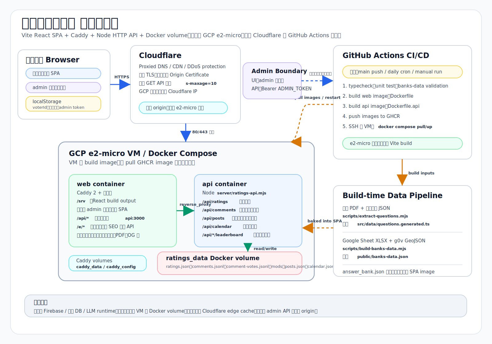

# 公股銀行面試題目選擇器

React + Bootstrap + TypeScript 的靜態網站，適合部署到 Cloudflare 網域 + GCP e2-micro。題庫 PDF 放在 `public/20260515bank123.pdf`，語意標註資料放在 `bank123_pdftojson.json`，建置前會產生前端使用的題庫資料。

## 系統架構



實線是 runtime 請求流，虛線是建置／部署流。資料層目前是 SQLite 遷移狀態：已切換的互動資料讀寫同一個 `ratings_data` volume 裡的 `/data/app.db`，原 JSON / JSONL 檔仍保留作為匯入來源與回滾安全網。圖上重點與詳細說明另存於 [docs/system-architecture.md](docs/system-architecture.md)。

## 功能

- 依年齡、工作年資、是否應屆、是否有銀行經驗、銀行年資、是否有銷售經驗推薦題目。
- 可選擇準備重點：均衡準備、報考動機、業務推廣、客戶應對、法遵洗防、時事財經。
- 可搜尋題目、分類或標籤。
- 可依題型分類篩選。
- 每題可直接「展開答案」，從 `answer_bank.json` 讀取該題專屬答題重點與示範回答，並依目前考生條件加上微調句。
- 參考答案旁可用 1-5 顆星評分，平均分數與評分人數會儲存在 VM 本機 Docker volume。
- 每題答案下方有匿名留言板，支援讚、倒讚、依時間或分數排序；淨分數 `<= -100` 的留言預設隱藏，使用者可自行切換顯示。
- 經驗分享文章底下也有一個獨立的匿名留言板（同樣支援讚／倒讚與排序），與題目留言分開存放、後台分開管理。
- 留言列表最多顯示約 5 則高度，超過後在留言區內部捲動，避免卡片被大量留言撐長。
- 統計小卡可直接點擊篩選，例如點選「進階題」或「重要十大問題」會更新下方題目清單。
- 手機版會把考生條件收進彈出式選單，保留更多空間給題目列表。
- 首屏提供免責提醒，推薦結果僅供準備方向參考，仍應以自身經歷為主。
- 畫面左下角顯示 `Credit: 公股銀行招考討論區 Jack/聯合哥`，右下角提供回到頂端按鈕。
- 題庫 PDF 保留在 `public`，網站上可直接開啟原始 PDF。
- 試場資訊（`/venues`）彙整各家招考的試場情報：頁面上方為**試場地圖**，用 Leaflet + OpenStreetMap（CARTO Voyager 圖磚、免金鑰）標出台北市與新北（板橋／中和／永和）常用考場，marker 依分區上色編號、與側欄清單連動，彈窗附最近捷運站、路線色與「在 Google 地圖開啟」；下方依銀行分組列出筆試各試場缺考統計與面試各試場考題。考場資料在 `src/data/examVenues.ts`，地圖元件在 `src/components/VenueMap.tsx`。
- 年薪計算機（`/salary`）依職等、調薪與升等機制試算年資 1～30 年的年薪：拉桿設定年資即顯示總薪資、當年年薪與平均月領，並附逐年明細（固定列出 1～30 年）。月薪五等 40,900 元起、每年調薪 2%，升等時程為五→六、六→七各 2 年、七→八 3 年、八→九 6 年（九等自第 14 年起）；年薪含 12 個月本薪、獎金 4 個月、加班費（時薪＝月薪÷30÷8，每月加班 12 小時、無條件捨去）與行儲利息，第一年獎金因新人考績打八折。計算邏輯集中在 `src/lib/salary.ts`（附 `salary.test.ts` 對帳測試）。

## 本機開發

### 環境需求

- Node.js 20 以上（Vite 8 / TypeScript 6 需要）。可用 `node -v` 確認。
- npm（隨 Node 內建即可）。
- 第一次 clone 後先安裝相依套件：

```bash
npm install
```

整個系統分兩個部分，本機測試時通常會各開一個 terminal：

| 部分 | 指令 | 預設位址 | 負責內容 |
| --- | --- | --- | --- |
| 前端（Vite dev server） | `npm run dev` | http://localhost:5173 | React 畫面、題庫、答案展開、選題邏輯 |
| 後端（輕量 Node API） | `npm run api:local` | http://127.0.0.1:3000 | 評分、留言、留言投票、行事曆、心得文、小遊戲排行榜 |

Vite dev server 會把所有 `/api/*` 請求 proxy 到 `http://127.0.0.1:3000`（設定在 [vite.config.ts](vite.config.ts)），所以前端程式碼一律打相對路徑 `/api/...`，本機與正式環境都不用改。

### 只測前端（不需要 API）

如果只想看畫面、題庫、選題排序與答案展開（這些都是靜態資料，不依賴後端）：

```bash
npm run dev
```

開瀏覽器到終端機印出的位址（預設 http://localhost:5173）。此時評分、留言等功能會因為連不到 API 而載入失敗，但**不影響主畫面**，console 會出現幾個 `/api/...` 的 fetch 錯誤屬正常。

### 前端 + 後端都測（完整功能）

要測評分、留言、留言投票、行事曆、心得文或小遊戲排行榜，請**另開一個 terminal**，啟動本機 API：

```bash
npm run api:local
```

`api:local` 已經幫你把所有資料檔指向專案內的本機檔（不會碰到正式環境 `/data`），對應 [package.json](package.json) 裡的設定，等同於：

```bash
RATINGS_FILE=.local-ratings.json \
COMMENTS_FILE=.local-comments.jsonl \
COMMENT_VOTES_FILE=.local-comment-votes.jsonl \
COMMENT_MOD_FILE=.local-comment-mods.jsonl \
POST_COMMENTS_FILE=.local-post-comments.jsonl \
POST_COMMENT_VOTES_FILE=.local-post-comment-votes.jsonl \
POST_COMMENT_MOD_FILE=.local-post-comment-mods.jsonl \
CHECKGAME_FILE=.local-checkgame-top.json \
NUMBERGAME_FILE=.local-numbergame-top.json \
CALENDAR_FILE=.local-calendar.json \
POSTS_FILE=.local-posts.json \
POST_VOTES_FILE=.local-post-votes.jsonl \
node server/ratings-api.mjs
```

> `COMMENTS_*` 是題目（面試篩選器）留言板的資料；`POST_COMMENTS_*` 是經驗分享
> 文章底下的留言板。兩套分開存、後台也分開管理，互不影響。

這些 `.local-*` 檔已列在 `.gitignore`，第一次寫入評分／留言時才會自動建立，可以隨時刪掉重置本機資料。

啟動後可以直接打健康檢查端點確認 API 活著：

```bash
curl http://127.0.0.1:3000/api/health
```

兩個 server 都跑起來後，回到 http://localhost:5173 操作，評分與留言就會真的存進本機 `.local-*` 檔。

> 補充：`npm run api`（不帶 `:local`）會用 server 程式內建的 `/data/...` 預設路徑，那是給正式環境 Docker volume 用的；本機開發請用 `npm run api:local`。

### 本機後台（admin）登入

招考行事曆／留言管理等 `/api/admin/*` 寫入受 `ADMIN_TOKEN` 保護，沒設就整個後台停用（任何密碼都會回 401）。`npm run api:local` 已內建本機預設密碼：

- **本機 admin 密碼：`local-admin`**

本機開發時，後台在 `/admin` 路徑（只有 dev 模式才開放），啟動前端後開 http://localhost:5173/admin ，在登入框輸入 `local-admin` 即可。

想換成自己的密碼，啟動前先 export 同名環境變數即可覆寫（不必改 `package.json`）：

```bash
ADMIN_TOKEN=我的密碼 npm run api:local
```

> 這個 `local-admin` 只是本機方便用的預設值，正式環境的 `ADMIN_TOKEN` 是另外在 VM 設定的長隨機字串，見 [deploy/CICD.md](deploy/CICD.md)，兩者互不影響。

### 常用本機指令

| 指令 | 用途 |
| --- | --- |
| `npm run dev` | 啟動前端 dev server（HMR 熱更新） |
| `npm run api:local` | 啟動本機 API（資料寫入專案內 `.local-*` 檔） |
| `npm run typecheck` | 只跑 TypeScript 型別檢查（`tsc -b`） |
| `npm run test` | 跑 Vitest 單元測試 |
| `npm run build` | 完整建置（含 `extract:questions` 與預渲染），輸出到 `dist/` |
| `npm run preview` | 用 Vite 預覽 `dist/` 的建置結果，模擬正式靜態站 |

> `npm run preview` 預覽的是建置後的靜態檔，不含 API；要連 API 一樣得另開 `npm run api:local`。

## 更新題庫

如果已經有語意標註 JSON，請更新根目錄的 `bank123_pdftojson.json` 後執行：

```bash
npm run extract:questions
```

若沒有 `bank123_pdftojson.json`，腳本會退回從 `public/20260515bank123.pdf` 抽文字並用關鍵字規則標籤化。

## 填寫預製答案

答案庫在根目錄 `answer_bank.json`。每題用題號當 key：

```json
{
  "1": {
    "keyPoints": ["這題答題重點 1", "這題答題重點 2", "這題答題重點 3"],
    "answer": "這題專屬的完整示範回答。",
    "variants": {
      "freshGraduate": "應屆畢業生版本補充句。",
      "noBankExperience": "無銀行經驗版本補充句。",
      "focusMotivation": "準備重點為報考動機時的補充句。"
    }
  }
}
```

可用下面指令產生分批給 web ChatGPT 的提示詞：

```bash
npm run make:answer-prompts
```

它會產生：

- `answer_bank.template.json`：123 題完整空白 JSON 格式。
- `answer_prompts/question-001.md` 到 `question-123.md`：一題一題貼給 GPT 用。
- `answer_prompts/chunk-01.md` 到 `chunk-13.md`：每 10 題一批貼給 GPT 用。

如果想每批 5 題：

```bash
npm run make:answer-prompts -- 5
```

把 ChatGPT 回傳的 JSON 合併進 `answer_bank.json` 後，重新整理本地頁面即可看到答案。前端會依年齡、年資、是否應屆、銀行經驗、銀行年資、銷售經驗與準備重點，挑出對應的 `variants` 顯示在主答案下方。目前 `answer_bank.json` 已補齊 123 題。

## GCP e2-micro 部署

目前不使用 Vercel、Firebase 或外部資料庫。網域在 Cloudflare 託管並開橘雲（Proxied），A record 指向 GCP e2-micro 的外部 IP，VM 上用 Docker Compose 跑 Caddy 靜態前端與輕量 Node API；API 只負責參考答案評分、留言、留言投票與招考行事曆資料。

正式環境的幾個重點：

- **TLS**：Caddy 用 Cloudflare **Origin Certificate**（15 年）終止 TLS，不跑 Let's Encrypt；Cloudflare SSL/TLS 模式為 **Full (strict)**。
- **邊緣快取**：公開 GET API 帶 `s-maxage=10`，搭配 Cloudflare `/api/*` Cache Rule，由邊緣吸收重複讀取，e2-micro 在高流量下幾乎閒置。
- **防火牆**：GCP 80/443 只允許 Cloudflare 網段，外人無法繞過 Cloudflare 直連 VM（取代 Cloudflare Tunnel，單機 e2-micro 用 Tunnel 並不省錢）。

部署細節見：

- [deploy/README.md](deploy/README.md)
- [deploy/CICD.md](deploy/CICD.md)

`npm run build` 會先執行 `npm run extract:questions`，確保最新語意 JSON 或 PDF 會轉成網站資料。

## 選題邏輯

目前這套不是 AI 即時判斷，而是透明、可調整的規則式推薦系統。實作位置主要在：

- `scripts/extract-questions.mjs`：優先讀取 `bank123_pdftojson.json` 的語意標註；若檔案不存在，才從 PDF 抽題並用關鍵字規則產生標籤與難度。
- `src/lib/scoring.ts`：依考生條件計算每題分數。
- `src/pages/HomePage.tsx`：排序、篩選並顯示推薦題目。

### 資料處理流程

1. 題庫 PDF 放在 `public/20260515bank123.pdf`。
2. Gemini 或人工整理後的語意標註 JSON 放在 `bank123_pdftojson.json`。
3. 執行 `npm run extract:questions`。
4. 如果 JSON 存在，系統會驗證題號、分類、題目、標籤與難度，並移除 `[cite: n]` 這類來源註記。
5. 如果 JSON 不存在，系統才會抽出 PDF 文字，依章節與關鍵字產生 `category`、`difficulty`、`tags`。
6. 產生 `src/data/questions.generated.ts`，前端直接讀取這份靜態資料。

### 題目標籤

每題可以有多個標籤。目前主要由 `bank123_pdftojson.json` 的語意標註決定，以下是前端支援的標準標籤；如果退回 PDF 關鍵字模式，才會用右欄的關鍵字判斷。

| 標籤 | 介面顯示 | 判斷條件 |
| --- | --- | --- |
| `top10` | 十大必問 | 題號小於等於 10 |
| `motivation` | 動機 | 包含：為什麼、動機、應徵、報考、錄取 |
| `freshGraduate` | 新鮮人 | 包含：大學、畢業、科目、社團、升學、研究所、實習、應屆 |
| `experienced` | 有年資 | 包含：上一份工作、離職、轉換跑道、工作經驗、過去、職涯 |
| `noBankExperience` | 無銀行經驗 | 包含：沒有經驗、無銀行、非本科系、白紙 |
| `bankExperience` | 銀行實務 | 包含：銀行經驗、實習、櫃檯、存匯、業務、部門 |
| `sales` | 銷售 | 包含：銷售、推銷、行銷、業績、產品、金融商品、理專、保險、債券 |
| `customerService` | 客戶 | 包含：客戶、客人、奧客、客訴、VIP、服務、大聲、抱怨 |
| `compliance` | 法遵 | 包含：洗錢、法規、內控、內部控制、金管會、通報、防詐、違法、規定 |
| `fintech` | 數位金融 | 包含：數位、金融科技、行動支付、台灣 Pay、開放銀行 |
| `marketNews` | 時事 | 包含：央行、升息、降息、匯率、房市、通膨、新聞、關稅、碳、美元、日幣 |
| `scenario` | 情境 | 包含：如果、遇到、怎麼處理、如何處理、怎麼辦 |
| `manager` | 主管 | 包含：主管、長官 |
| `teamwork` | 團隊 | 包含：同事、團隊 |
| `pressure` | 抗壓 | 包含：壓力、挫折、抗壓、情緒、不合理 |

### 難度判斷

| 難度 | 判斷條件 |
| --- | --- |
| 核心必練 | 題號小於等於 10 |
| 進階 | 包含：央行、洗錢、內部控制、金管會、外匯、升息、降息、匯率 |
| 情境題 | 包含：如果、遇到、推銷、銷售、客戶、主管 |
| 基礎 | 不符合以上條件 |

### 考生條件

| 條件 | 選項 |
| --- | --- |
| 年齡 | 未選擇、24 歲以下、25-29 歲、30 歲以上 |
| 工作年資 | 未選擇、無正式工作經驗、未滿 2 年、2-5 年、5 年以上 |
| 是否應屆畢業生 | checkbox。未勾選代表否 |
| 是否有銀行經驗 | checkbox。未勾選代表否 |
| 銀行年資 | 未滿 1 年、1-3 年、3 年以上。只有選擇有銀行經驗時顯示 |
| 是否有銷售經驗 | checkbox。未勾選代表否 |
| 準備重點 | 均衡準備、報考動機、業務推廣、客戶應對、法遵洗防、時事財經 |
| 顯示題數 | 10 到 123 題，每 1 題為一級 |

預設條件：

| 條件 | 預設值 |
| --- | --- |
| 年齡 | 未選擇 |
| 工作年資 | 未選擇 |
| 是否應屆畢業生 | 未選擇 |
| 是否有銀行經驗 | 未選擇 |
| 銀行年資 | 未滿 1 年 |
| 是否有銷售經驗 | 未選擇 |
| 準備重點 | 均衡準備 |
| 顯示題數 | 123 |

### 準備重點對應標籤

使用者選擇「準備重點」後，系統會提高對應標籤的題目分數。

| 準備重點 | 對應標籤 |
| --- | --- |
| 均衡準備 | `top10`、`motivation`、`scenario`、`customerService` |
| 報考動機 | `motivation`、`top10`、`noBankExperience` |
| 業務推廣 | `sales`、`customerService`、`scenario` |
| 客戶應對 | `customerService`、`scenario`、`pressure` |
| 法遵洗防 | `compliance`、`scenario` |
| 時事財經 | `marketNews`、`fintech` |

### 加權算法

預設進站時年齡與工作年資都未選擇，系統不計分也不排序，題目會照題號從 `1` 到 `123` 完整顯示。此時 checkbox 雖然視覺上未勾選，但不會先觸發「否」的加權。只要使用者選擇年齡或工作年資，checkbox 的未勾選狀態才會被視為「否」並進入加權排序。

加權排序模式下，每一題一開始都有基本分 `10` 分，接著依條件加減分。最後分數會限制在 `0-100`，避免題目適配度超出百分比語意。

| 條件 | 分數 | 顯示原因 |
| --- | ---: | --- |
| 題目有 `top10` 標籤 | +28 | 口試高頻核心題 |
| 使用者是應屆畢業生，題目有 `freshGraduate` | +22 | 適合應屆畢業生 |
| 使用者不是應屆畢業生，題目有 `experienced` | +18 | 可連結工作經歷 |
| 使用者沒有銀行經驗，題目有 `noBankExperience` | +24 | 補強無銀行經驗說法 |
| 使用者有銀行經驗，題目有 `bankExperience` | +18 | 延伸銀行實務經驗 |
| 使用者有銀行經驗且銀行年資未滿 1 年，題目有 `bankExperience` | +8 | 不額外顯示原因 |
| 使用者有銀行經驗且銀行年資未滿 1 年，題目有 `customerService` 或 `scenario` | +8 | 強化銀行適應期情境 |
| 使用者有銀行經驗且銀行年資 1-3 年，題目有 `bankExperience` | +12 | 不額外顯示原因 |
| 使用者有銀行經驗且銀行年資 1-3 年，題目有 `sales` 或 `compliance` | +8 | 連結銀行實務表現 |
| 使用者有銀行經驗且銀行年資 3 年以上，題目有 `bankExperience` | +14 | 不額外顯示原因 |
| 使用者有銀行經驗且銀行年資 3 年以上，題目有 `manager` 或 `teamwork` | +10 | 延伸資深行員協作題 |
| 使用者有銀行經驗且銀行年資 3 年以上，題目有 `compliance` 或 `marketNews` | +8 | 展現進階銀行視野 |
| 使用者有銷售經驗，題目有 `sales` | +18 | 凸顯銷售經驗 |
| 使用者沒有銷售經驗，題目有 `sales` | +8 | 預先準備業績壓力 |
| 工作年資是無正式工作經驗，題目有 `freshGraduate` | +10 | 不額外顯示原因 |
| 工作年資是 5 年以上，題目有 `experienced` | +10 | 不額外顯示原因 |
| 年齡是 30 歲以上，題目有 `experienced` | +8 | 不額外顯示原因 |
| 年齡是 24 歲以下，題目有 `freshGraduate` | +8 | 不額外顯示原因 |
| 題目符合準備重點對應標籤，且準備重點是「均衡準備」 | 每個命中標籤 +8，最多 +20 | 均衡準備 |
| 題目符合準備重點對應標籤，且準備重點不是「均衡準備」 | 每個命中標籤 +18，最多 +28 | 對應準備重點 |
| 使用者沒有銀行經驗，題目有 `manager` 或 `teamwork` | -14 | 不額外顯示原因 |
| 使用者沒有銀行經驗，題目有 `bankExperience` 且不是動機題 | -10 | 不額外顯示原因 |
| 使用者有銀行經驗但銀行年資未滿 1 年，題目有 `manager` 或 `teamwork` | -8 | 不額外顯示原因 |
| 使用者是應屆畢業生，題目有 `experienced` 且不是前 10 題 | -8 | 不額外顯示原因 |
| 題目是進階題，但準備重點不是「時事財經」或「法遵洗防」 | -4 | 不額外顯示原因 |

顯示在題目卡片上的原因最多只取前 3 個，避免介面太吵。

### 排序與篩選流程

前端每次條件改變後會重新計算：

1. 先依「題型分類」篩選。
2. 再依搜尋關鍵字篩選。搜尋範圍包含題目文字、分類與標籤。
3. 如果年齡與工作年資都未選擇，依題號由小到大排序。
4. 如果有任一條件，對篩選後的每一題執行 `scoreQuestion()`。
5. 加權排序模式下，依分數由高到低排序。
6. 如果分數相同，題號小的排前面。
7. 依「顯示題數」截取前 N 題。

```ts
questions
  .filter(byCategory)
  .filter(byKeyword)
  .map((question) => hasProfileCriteria ? scoreQuestion(question, profile) : { question, score: 0 })
  .sort((a, b) => hasProfileCriteria
    ? b.score - a.score || a.question.id - b.question.id
    : a.question.id - b.question.id)
  .slice(0, practiceSize);
```

### 範例

假設使用者條件是：不是應屆畢業生、沒有銀行經驗、沒有銷售經驗、準備重點是均衡準備。

題目：「可以說服我們為何要錄取沒有經驗/非本科系的畢業生嗎？」

| 命中原因 | 分數 |
| --- | ---: |
| 基本分 | +10 |
| 前 10 題核心題 | +28 |
| 無銀行經驗題 | +24 |
| 均衡準備命中 `top10` | +8 |
| 均衡準備命中 `motivation` | +8 |

總分約為 `78`，因此會排在很前面。

### 目前限制

1. 語意標籤品質取決於 `bank123_pdftojson.json`，如果 JSON 標錯，前端會照錯誤標籤排序。
2. 目前 JSON 只有正向標籤，還沒有 `negativeTags` 或信心分數。
3. 年齡與工作年資目前只影響「新鮮人」和「有年資」方向，還沒有細分到職等、報考類組或銀行別。
4. 現在是前端靜態排序，不會記錄使用者練習結果，也不會根據答題表現調整推薦。

### 後續可優化方向

1. 在 `bank123_pdftojson.json` 加上 `negativeTags` 與 `confidence`，讓 build 階段能保留更細的語意判斷。
2. 加上報考銀行、類組、學歷背景、是否轉職、是否有金融證照等條件。
3. 加上「已練習」、「不熟」、「想複習」狀態，做個人化排序。
4. 將每題分數拆成更明確的權重設定檔，例如 `src/data/scoring-rules.ts`。
5. 未來若要更聰明，可以在 build 階段呼叫 LLM API 重新產生 JSON，但網站 runtime 仍維持靜態。
