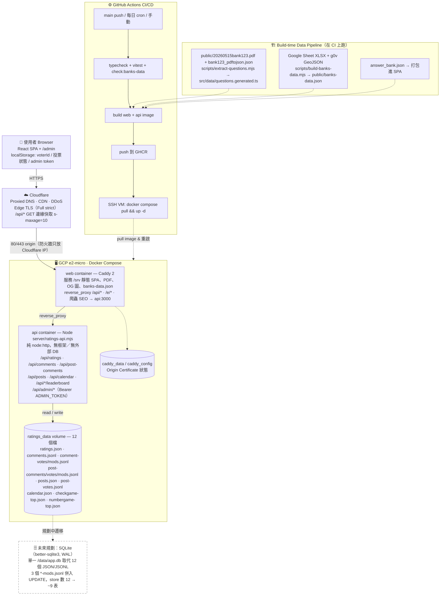

# 系統架構圖

這張圖依目前 repo 的實際檔案整理：Vite React SPA、Caddy web container、Node HTTP API、Docker Compose、Cloudflare、GitHub Actions，以及 VM 本機 Docker volume 持久化。內容與 [README.md](../README.md) 的「系統架構」一節同步；README 是主要閱讀位置，這裡是詳細／可編輯版。

> 註：實線是 runtime 請求流，虛線是建置／部署流。右下角虛線灰框是**目前尚未實作**的 SQLite 規劃，僅標註未來方向。

## 圖上的重點

- 前端是 Vite React SPA，正式環境由 Caddy container 服務靜態檔。
- API 是一個輕量 Node `node:http` sidecar，不使用外部資料庫。
- 使用者互動資料存進 Docker volume `ratings_data`，目前是 **12 個 JSON / JSONL 檔**：評分、題目留言（留言／投票／後台隱藏）、文章留言（留言／投票／後台隱藏）、經驗分享文章、文章投票、行事曆、兩個小遊戲排行榜。
- Cloudflare 負責 CDN/TLS/DDoS 與公開 GET API 的短快取；寫入和 admin API 不走 cache。
- GitHub Actions 負責 build image；e2-micro VM 只 pull image 和重啟容器，避免在 1GB RAM 機器上建置。

## 未來規劃：SQLite

資料層規劃從 12 個 JSON/JSONL 檔遷移到單一 `/data/app.db`（`better-sqlite3` + WAL）：

- 同一個 `ratings_data` volume，備份／搬遷仍是「複製一個檔」。
- 3 個 `*-mods.jsonl`（隱藏／刪除重播 log）改成直接 `UPDATE ... SET hidden`，可移除 → store 數 12 → 約 9 張表。
- `better-sqlite3` 同步 API，可拿掉現有的 `writeQueue` 序列化，交易保證一致性。
- e2-micro 適用：in-process、無常駐 DB daemon、幾乎零額外記憶體。

此為規劃，尚未實作；上圖以虛線灰框標示。
