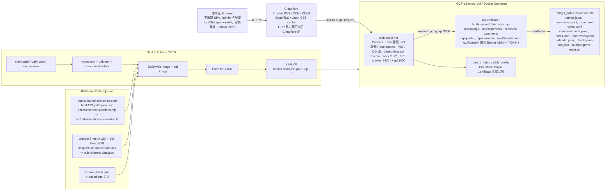

# 系統架構圖

這張圖依目前 repo 的實際檔案整理：Vite React SPA、Caddy web container、Node HTTP API、Docker Compose、Cloudflare、GitHub Actions，以及 VM 本機 Docker volume 持久化。

## 可編輯 Mermaid 版

## 圖上的重點

- 前端是 Vite React SPA，正式環境由 Caddy container 服務靜態檔。
- API 是一個輕量 Node `node:http` sidecar，不使用外部資料庫。
- 使用者互動資料存進 Docker volume `ratings_data`，包含評分、留言、文章、行事曆、小遊戲排行榜。
- Cloudflare 負責 CDN/TLS/DDoS 與公開 GET API 的短快取；寫入和 admin API 不走 cache。
- GitHub Actions 負責 build image；e2-micro VM 只 pull image 和重啟容器，避免在 1GB RAM 機器上建置。
